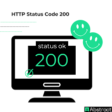

# Guía del módulo: Usuarios
Accesos rápidos: [Resumen](#resumen) · [Pasos](#pasos) · [Evidencias](#evidencias)
## Resumen
Este módulo gestiona altas de usuario mediante el endpoint ``POST`` descrito aquí:

[API Users](#api).

Repositorio del backend (autolink): https://github.com/org/backend-usuarios
## Pasos
1. Crear usuario con ``curl`` y cuerpo JSON (ver guía).

     Consulta la guía de uso de curl para más ejemplos.
2. Verificar respuesta **200 OK** y campos obligatorios.
## Evidencias
 

[Volver arriba](#volver)