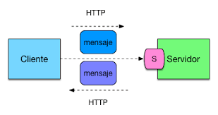
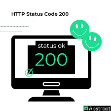

## Guia-del-módulo: Usuarios

Accesos rápidos: #resumen · #pasos · #evidencias

## Resumen
Este módulo gestiona altas de usuario mediante el endpoint `POST` descrito aquí:  
**API Users**  
Repositorio del backend https://github.com/gnc/backend-usuarios

## Pasos
1. Crear usuario con `curl` y cuerpo JSON (ver guía).  
   Consulta la guía de uso para ver más ejemplos.  
2. Verificar respuesta **200 OK** y campos obligatorios.

## Evidencias
 

---

[Volver arriba](README.md)