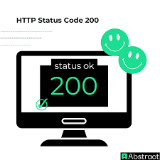

# **Guía del módulo: Usuarios**
Accesos rápidos: [Resumen](https://github.com/org/backend-usuarios ) · 
[Pasos](https://github.com/org/backend-usuarios ) · 
[Evidencias](https://github.com/org/backend-usuarios )
___
## **Resumen**
Este módulo gestiona altas de usuario mediante el endpoint `POST` descrito aquí:
API Users.
Repositorio del backend (autolink): https://github.com/org/backend-usuarios
Pasos
1. Crear usuario con curl y cuerpo JSON (ver guía).\
Consulta la guía de uso de curl para más ejemplos.
2. Verificar respuesta 200 OK y campos obligatorios.
 > ## Evidencias
\
[Volver arriba](#guía-del-módulo-usuarios)
