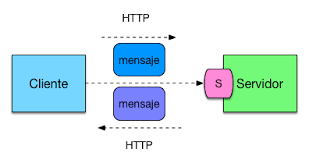

# Guía del módulo: Usuarios
Accesos rápidos: [Resumen · Pasos · Evidencias](www.google.com)

## Resumen
Este módulo gestiona altas de usuario mediante el endpoint `**POST**` descrito aquí:
[API Users](www.google.com).  
Repositorio del backend (autolink): [https://github.com/org/backend-usuarios](https://github.com/org/backend-usuarios)

## Pasos
1. Crear usuario con `curl` y cuerpo JSON (ver guía).
Consulta la [guía de uso de curl](www.google.com) para más ejemplos.
2. Verificar respuesta **200 OK** y campos obligatorios.
## Evidencias

[Volver arriba](www.google.com)