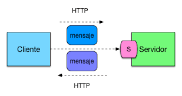

# Guía del módulo: Usuarios
Accesos rápidos: [Resumen](resumen) · [Pasos](pasos) · [Evidencias](evidencias)
## Resumen
Este módulo gestiona altas de usuario mediante el endpoint <code>**POST**</code> descrito aquí:
[API Users](apiusers).
Repositorio del backend (autolink): https://github.com/org/backend-usuarios
## Pasos
1. Crear usuario con curl y cuerpo JSON (ver guía).
Consulta la [guía de uso de curl](guiadeusodecurl) para más ejemplos.
Verificar respuesta **200 OK** y campos obligatorios.
## Evidencias

\
\
[Volver arriba](volverarriba)